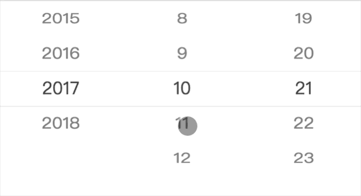

# vue-quick-picker
[](https://travis-ci.org/duyanpeng/vue-simple-picker)
[](https://www.npmjs.com/package/vue-simple-picker)


基于vue的适用于处理复杂数据的高度定制化的移动端picker插件


## 安装
---
`npm install vue-quick-picker -S`

```
// 使用vue-cli webpack时在main.js中引入
import Vue from 'vue';

import VueQuickPicker from 'vue-quick-picker';

Vue.use(VueQuickPicker)
```
```
// 直接引用打包之后的版本，不推荐使用，推荐使用上面的方法引入
import Vue from 'vue';
// 注意引用的是 vue-quick-picker下的dist/index.js
import VueQuickPicker from 'vue-quick-picker/dist/index.js';
import 'vue-quick-picker/dist/index.css';  // 引入插件相关的css

Vue.use(VueQuickPicker)
```
## 使用
---
```html
<template>
    <div>
        <quick-picker :data="data" @change="handleChange" ref="picker"></quick-picker>
    </div>
</template>
```
```javascript
// 最多只能选当前日期的时间选择器例子

// 输入初始年份，生成到当前年数组
function initYearValue(year) {
    let arr = [];
    let length = new Date().getYear() + 1900;
    for (let i = year; i <= length; i++) {
        arr.push(i);
    }
    return arr;
}
// 输入最大月份，生成月份数组
function initLimitMonth(month) {
    let arr = [];
    for (let i = 1; i <= parseFloat(month); i++) {
        arr.push(i);
    }
    return arr;
}
// 输入最大日期，生成日期数组
function initLimitDay(day) {
    let arr = [];
    for (let i = 1; i <= parseFloat(day); i++) {
        arr.push(i);
    }
    return arr;
}
export default {
    data() {
        retutn{
            value: [],
            data: [
                {
                    values: initYearValue(2015),
                    default: new Date().getYear() + 1900 - 2015,
                },
                {
                    values: initLimitMonth(12),
                    default: new Date().getMonth(),
                },
                {
                    default: new Date().getDate() - 1,
                    values: initLimitDay(31),
                }
            ]
        }
    },
    methods: {
        // 获得时间回调
        handleChange(values = []) {
            // 当前年月日
            const nYear = new Date().getYear() + 1900;
            const nMonth = new Date().getMonth() + 1;
            const nDay = new Date().getDate();
            // 年或月改变都要重新计算该月的最大天数
            if (values[0] !== this.value[0] || values[1] !== this.value[1]) {
                this.refreshDay(values[0], values[1], values[2])
            }
            if (values[0] !== nYear) {
                this.refreshMonth()
            }
            // 当年等于当前年时，限制最大月
            if (values[0] === nYear) {
                this.refreshMonth(values[1])
            }
            // 当年月等于当前日期时，限制最多只能选择当前日期
            if (values[0] === nYear && values[1] === nMonth) {
                this.refreshDay(values[0], values[1], values[2], new Date().getDate())
            }
            this.value = values;

        },
        // 根据年月 返回当月最大天数，如31天30天或2月的28天或29天等情况
        getMonthDay(year, month) {
            var dayNum = new Date(year, month, 0); //获取当月的最后一天
            let day = dayNum.getDate();
            return day;
        },
        // 重新生成最大天数
        refreshDay(year, month, day, limitDay = false) {
            // 最后一天
            const lastDay = limitDay ? limitDay : this.getMonthDay(year, month);
            const dayValues = initLimitDay(lastDay);
            const dayItem = {
                values: dayValues,
                // 如果已经选中了大于该月最后一天的天数，则滚动到该月最后一天
                default: day > lastDay - 1 ? lastDay - 1 : day - 1,
            }
            this.$set(this.data, 2, dayItem);
            // default改变重新刷新picker参数传index
            this.$refs.picker.refresh(2);
        },
        // 重新生成最大月
        refreshMonth(month) {
            if (!month) {
                this.data[1].values = initLimitMonth(12)
                return
            }
            const monthItem = {
                values: initLimitMonth(new Date().getMonth() + 1),
                // 如果已经选中了大于该月最后一天的天数，则滚动到该月最后一天
                default: month > new Date().getMonth() + 1 ? new Date().getMonth() : month - 1,
            }
            this.$set(this.data, 1, monthItem);
            // default改变重新刷新picker参数传index
            this.$refs.picker.refresh(1);
        }

    },
    mounted() {

    }
}
```

## 配置
---
参数|类型|说明|备注
:--:|:--:|:--:|:--:
v-bind:data|数组[ {},{} ]|数据|picker展示的数据，如时间，地址等
v-on:change|函数function|回调函数|picker滚动展示的数据变化时触发,返回最新的数据
ref.refresh(index)|函数function|当改变选项的default值时，需要通知picker重新滚动到default的值|参数传data的index,没有参数则全部滚动到初始default的值
defaultStyle|对象{}|滚动条目的展现样式|{fontFamily:'inherit',fontSize:'16px',color:'#808080'}提供的配置项
wheelStyle|布尔true/false|是否展示3D样式|默认是true
canClick|布尔true/false|是否支持点击滚动到目标选项功能|默认是true
---
### data的配置:
参数|类型|说明|备注
:--:|:--:|:--:|:--:
values|数组[ ]|每列的数据|数据可以是字符串，数字，或者对象
default|数字 number|默认选中项的索引|
valueKey|字符串 string|当values数组内的值是对象时，通过该属性指定渲染字段|
textAlign|字符串string|指定文字的对齐方式|可选值'center','left','right',默认'center'
flex|数字number|占宽度的比例|默认：1
---
### 选中条目样式覆盖方法:

当前组件类名(或id名)  >>> .vsim-picker-item-active
例如:
```css
// 使选中的条目为黑色
.parent >>> .vsim-picker-item-active{
    color:black;
    font-size:20px;
}

// 使选中的条目上下两条缩小产生3D效果(wheelStyle为true时生效)
.parent >>> .vsim-picker-item-next{
    transform: scaleY(0.9);
}

// 使picker边界上下两条缩小产生3D效果(wheelStyle为true时生效)
.parent >>> .vsim-picker-item-far{
    transform: scaleY(0.8);
}

```
## 提示
更好用的picker组件,及更多vue移动端组件，欢迎使用： [garen-ui](https://duyanpeng.github.io/garen/)

## 版本更新说明
---
版本号|说明|
:--:|:--:|
1.0.1|更新文档
0.0.5|增加样式拓展功能
0.0.4|增加单元测试
0.0.3|增加readme文档
0.0.1|项目初始化

## 联系我
---
QQ:215028726
